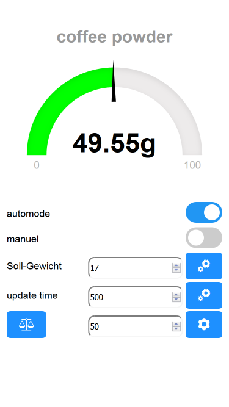

# Coffee Grinder 

This is a automation of a coffee grinder.

Written by variablo87.

The setup ist based on a Sonoff TH10, a kitchen scale and a Coffee Grinder. The Scale detect the Filter Holder of a Espresso Machine and grind the defined target value to the Filter Holder. The Grinder provied a Access Point mode for calibrate the scale and setup the target value. The UI is based on a HTML5 Page and a Websocket communication.

## Inspierd by:
[MillControll](https://github.com/romanseidl/MillControl/blob/master/README.md), [kaffee-netz.de](https://www.kaffee-netz.de/threads/millcontrol-arduino-muehlensteuerung-mit-timer-gewichtsautomatik-waagensteuerung-und-brew-timer.95553), [decentespresso](https://de.decentespresso.com/pro_grinder)

## I used this posts:
### for Firmware:
[for websocket](https://www.hackster.io/rayburne/nodemcu-esp8266-remote-temperature-using-websockets-5956c4), [for websocket2](http://vidieukhien.xyz/vi/2016/11/03/esp8266-spiffs-web-server-html5-websocket-control-dieu-khien-thiet-bi-qua-web-socket/), [for sonoff flashing](https://loads.pickle.me.uk/2016/10/30/flashing-custom-firmware-to-a-sonoff-th10/16/), [for upgrade sonoff flash](http://www.andremiller.net/content/upgrading-sonoff-wireless-smart-switch-flash-memory-esp8266),  [add i2c to sonoff](http://tinkerman.cat/sonoff-th10-th16-sensors-displays-actuators/)

### for Webside:
[webapp](https://www.netguru.co/codestories/few-tips-that-will-make-your-pwa-on-ios-feel-like-native), [flashing icon](https://stackoverflow.com/questions/36505651/how-to-animate-icon-fa-circle-using-css-to-look-as-recording-video-blinking-red/36505930)

## Hardware:

- [winbond 25Q32FVSIG](https://www.winbond.com/resource-files/w25q32fv%20revi%2010202015.pdf)
- [Sonoff TH 10](https://www.itead.cc/wiki/Sonoff_TH_10/16)
- [2.5mm 4-pin jack socket for audio](https://www.amazon.de/gp/product/B004HTHI4Q/ref=oh_aui_detailpage_o09_s00?ie=UTF8&psc=1)
- [2.5mm 4-pin jack to jack 1.8 m](https://www.amazon.de/gp/product/B007U91UB2/ref=oh_aui_detailpage_o05_s00?ie=UTF8&psc=1)
- [Digital Scale 0.1-1000g](https://www.ebay.de/itm/0-1-1000g-Prazisionswaage-Feinwaage-schmuck-waage-Digital-waage-miniwaage-/222287194987?hash=item33c1596b6b)

## I used this arduino librarys :
- ESP8266WiFi at Version 1.0     
- ArduinoOTA at Version 1.0     
- ESP8266WebServer at Version 1.0   
- EEPROM at Version 1.0       
- Hash at Version 1.0         
- ESP8266mDNS
- WebSockets at Version 2.1.1 
- [HX711](https://github.com/bogde/HX711) by Bogde add modification

compiled for Node MCU 1.0 (ESP-12E Module) Sketch uses 332,240 bytes (31%) of program storage space. Maximum is 1,044,464 bytes. Global variables use 37,620 bytes (45%) of dynamic memory, leaving 44,300 bytes for local variables. Maximum is 81,920 bytes.

